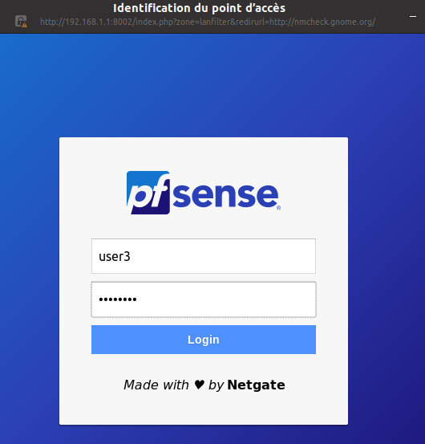
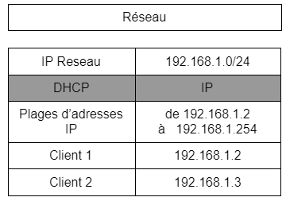

<h1 align="center"> Projet-Infra-SI </h1>

Groupe n°19

<B>Corentin Baudrin</B> - B1 B info

<B>Brahim Gnaoui</B> - B1 B info
 

<h2> Projet n°2 - Routeur</h2>
Mise en place d’un routeur qui gère les différentes zones réseaux d’une petite entreprise (avec
certaines fonctionnalités additionnelles, en plus du routage simple).

### Livrable

Toute les informations détaillées sur la manière dont nous avons procédé pour la mise en place du routeur se trouvent dans le fichier "PROJET INFRA GROUPE 19.pdf" rendu en tant que livrable.

#### Technologie

Aprés avoir lu de la documentation sur differentes technologies telles que Pfsense ou Opnsense, nous nous sommes sentis plus à l'aise avec Pfsense et l'avons donc choisi.

<h3> I - Configuration de Pfsense</h3>

Dans un premier temps avant l’installation de la machine nous lui avons créer plusieurs réseaux. Ces réseaux étant un NAT permettant d’accéder à internet pour le routeur. Et deux réseaux NAT différents afin que les machines qui veulent se connecter à internet doivent passer par le routeur.

Lorsque l'on arrive à la page d'accueil de Pfsense on choisit l'option numero 2 :

- On choisit donc la nouvelle adresse IPV4 de la machine dans notre cas nous avons choisis 192.168.1.1
- On choisit ensuite le masque : 24 dans notre cas
- On ne veut pas de passerelle donc on n’entre rien 
- Pas d’IPV6
- On active le DHCP sur notre LAN
- On rentre ensuite notre plage d’adresse, dans notre cas 192.168.1.2 - 192.168.1.254

L'accés à l'interface devrait donc être configurée.

<h3> II - Configuration du portail captif</h3>

####  1 - Mise en place du portail captif

Depuis l’interface web du routeur en tant qu’administrateur, dans les services proposés il y a la possibilité de mettre en place un portail captif.

Lorsqu’on clique sur "Services" puis “Captive portal” on nous donne la possibilité de configurer son portail captif avec nos propres paramètres.

Nous avons choisi de le configurer en interface LAN et d’y autoriser 6 connexions au maximum.
Le client sera également déconnecté au bout de 30 minutes d’inactivité et sera déconnecté au bout de 900 minutes de force quoi que le client fasse.
Comme méthode d'authentification nous utilisons “Use an authentication backend” afin que le client soit obligé de s’identifier pour accéder au réseau.

####  2 - Configuration d’un groupe d’utilisateurs 

Ensuite, toujours dans l’interface web du routeur, on est aller dans l’onglet “System” puis dans “User manager”.
Il faut choisir la rubrique “Groups”. On choisit le nom de groupe de notre portail captif afin d’y intégrer tous nos utilisateurs autorisés.

Et dans le scope il faut absolument mettre en local.

Les cases dans “Group membership” est ce qui devrait apparaître lorsqu’on y créer des utilisateurs. L’admin doit toujours être dans la case “Not members", dans le cas contraire tous les utilisateurs seront reconnus en tant qu’administrateurs.

Dans les options de “Assigned Privilèges” parmi la liste des services proposés il faut choisir “User - Services: Captive Portal Login”, c’est cette option qui va permettre au client du groupe de se connecter au portail captif.

#### 3 - Création d’un utilisateur

Pour créer un utilisateur, il faut quitter l’onglet “Groups” et aller dans “Users”. Nous y avons toutes les options comme la création d’un nom d'utilisateur et un mot de passe.

Dans “Group membership” il faut que le groupe crée précédemment soit dans le case “member of” ce qui va permettre d'intégrer l’utilisateur au groupe.
Normalement si toutes les étapes ont été respectées, nous devons voir apparaître dans “Users” la liste des utilisateurs créés en plus de l’admin. 

#### 4 - Connexion au réseau avec une VM

Lorsque l’on ouvre une VM qui est dans le même LAN notre notre routeur Pfsense, lorsque l’on essaie d'accéder à n’importe quelle page web, il doit y apparaître une page d’identification, il faut donc y rentrer les identifiants d’un utilisateur que nous avons créé dans notre groupe dédié au portail captif.

Si l’identifiant que l’on a entré est correct, on peut donc accéder au réseau, et on peut également voir dans l’interface web de l’admin que des utilisateurs sont connectés au réseau via le portail captif dans l’onglet “Status” puis “Captive Portal”.

<h3> III - Schéma réseau</h3>

#### Plan d'adressage 

